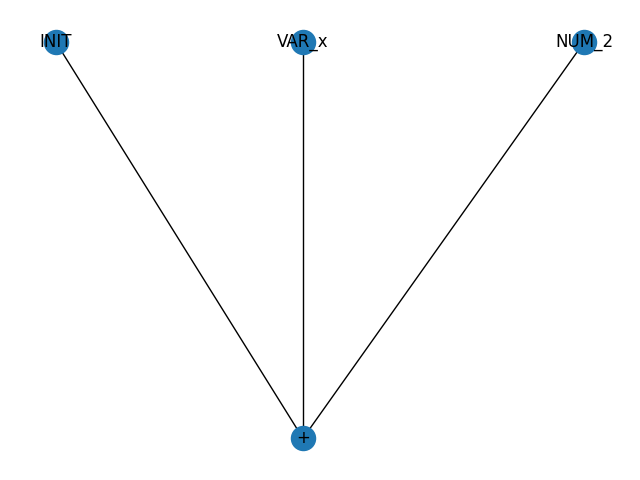

# Compilers
## Authors
Andrew Dunkerley | video: https://drive.google.com/file/d/1d3o0j3yX6PUCi-KNyLcpIku7l8vxV3Is/view?usp=drive_link

Manuel Barrera

Miguel Bustamante
## Development Report
### Introduction
The purpose of this document is to explain and explore the creation of a translator that acts like a compiler. The experiment has the capability of graphing the path that the compiler uses to access the values defined by our grammars.
### Translator Design
---
The translator use the following structure:
* Importing libraries to be used.
* Define imported tokens from libraries. 
* Define the accepted tokens. 
* Define accepted special simbols.
* Define Token management.
* Node visiting process.
* Checking the text file. 

1. Imports and Initial Setup
The code starts by importing necessary libraries:

```
import ply.lex as lex
import ply.yacc as yacc
import networkx as nx
import matplotlib.pyplot as plt
import cv2
import numpy as np
from networkx.drawing.nx_pydot import graphviz_layout
from library import *
```

The libraries imported
### Image Processing
---
The code being worked on has the capability to run a command and return the matrix of the values of a image using the command: 
```
execute

load nameofthefile
```
Example 

```
load("cv2.png")
```

After being executed the translator will show the following if ran from terminal:


### List Manipulation
---
The purpose of this module is to enable the translator to use the values allready assigned and apply them in python lists. 

Lists have the option of arithmetic operations, value assignation, value reassignation, and list manipulation. 

```
execute

mylist=[1,2,3,4,5]
```
The returned graph image should look as the following:


Creating the list then there is the capability to return and save values. To use individual values of a list it must be assigned to a variable and then it can be operated as normal.

```
>x=mylist[2]  
Result 3
```

Afterwards then the value can use different arithmetical operations such as sumations

```
>x+2
Result 5
```

Summation graph representation.



In case of the sumAB the following visualization is the following: 

```
list=[1,2,3,4,22]

>sumAB(x,list[4])
Result 25
```


### Numpy installation
---
Numpy is an almost elementary library needed for the use of statistics, and other values for basic mathematics. The need to have them in access is imperative and therefore the following installations have been done:

* mean
* standard deviation
* variance
* min
* max
* summation 
* product
* cumulative sum
* linspace

Mean, standard deviation and variance were chosen as they are basic operations in staticstics and that also work with lists. 

Minimum and Maximum are search operations that work on lists and return the lowest and highest values in a list. These operations should return a single value as result. 

Summation, Cumulative Sum and Product are perfect to test the list acessing capabilities by the imported libraries. 

Linspace test out the list creation automatically.

### Numpy implementation
---

#### Mean

Firstly the code brings to the symbol table np.mean as np.mean. This function calculates the mean (average) of a list of numbers. 

```
symbol_table["np.mean"] = np.mean
```

Aswell as the related tokens to np.mean([x,1,2])

```
'LPAREN',
'RPAREN',
```
Relevant regex expression 
```
def t_NUMBER(t):
    r'\d+\.?\d*'
    t.value = float(t.value) if '.' in t.value else int(t.value)
    return t

def t_VARIABLE(t):
    r'[a-zA-Z_][a-zA-Z0-9_]*'
    return t    

def p_term_num(p):
    """
    term : NUMBER
    """
    n = add_node({'type': 'NUMBER', 'label': f'NUM_{p[1]}', 'value': p[1]})
    p[0] = n    
```

With this implementation the translator has the capacity to run code:

```
#Input
m=[1,2,3,4,5]
mean_result=np.mean(m)

#Result
The result of this operation 'm=[1,2,3,4,5]' is '[1, 2, 3, 4, 5]'
The result of this operation 'mean_result=np.mean(m)' is '3.0'
```


#### Standard Deviation

`np.std()` is another function from the numpy library, specifically used to calculate the standard deviation of a list or array of numbers. 
In this case `np.std` is added to the symbol_table in the code:

`symbol_table["np.std"] = np.std`

This means that it can be invoked from the expressions being parsed by the parser.

The np.std() function computes the standard deviation of the given data. The standard deviation is a measure of the amount of variation or dispersion in a set of values. It tells us how much the values in a dataset differ from the mean value.

Example: We have a list of numbers and we want to calculate the standard deviation:

```
import numpy as np

# Example list of numbers
numbers = [1, 2, 3, 4, 5]

# Calculate the standard deviation using np.std
std_deviation = np.std(numbers)
print("The standard deviation is:", std_deviation)
```

In this example, `np.std(numbers)` will return the standard deviation of the numbers in the list, providing a measure of how spread out the numbers are from the mean value.

#### Variance
The `np.var()` function computes the variance of the given data. Variance is a measure of how much the values in a dataset vary from the mean value. It is calculated as the average of the squared differences from the mean.

Example:

```
import numpy as np

# Example list of numbers
numbers = [1, 2, 3, 4, 5]

# Calculate the variance using np.var
variance = np.var(numbers)
print("The variance is:", variance)
```
In this example, np.var(numbers) will return the variance of the numbers in the list, providing a measure of how spread out the numbers are from the mean value.

This functionality enhances the parser's capabilities for statistical calculations, allowing it to handle tasks such as mean, standard deviation, and variance computations within the expressions it processes.

#### Minimum value
`np.min()` is a function from the `numpy` library that calculates the minimum value of a list or array of numbers:

Like other numpy functions, np.min is added to the symbol_table in the code:

`symbol_table["np.min"] = np.min`

The `np.min()` function computes the minimum value of the given data. It returns the smallest value in an array or along a specified axis.

Example: We have a list of numbers and we want to find the minimum value:

```
import numpy as np

# Example list of numbers
numbers = [5, 3, 8, 1, 6]

# Calculate the minimum value using np.min
minimum_value = np.min(numbers)
print("The minimum value is:", minimum_value)
```
In this example, np.min(numbers) will return the minimum value from the list, which is `1`.

#### Sum
`np.sum()` is another function from the `numpy`library, designed to compute the sum of elements within a list or array of numbers:

`np.sum` is included in the `symbol_table`using the following code:

`symbol_table["np.sum"] = np.sum`

This inclusion allows for the invocation of `np.sum` from the expressions parsed by the parser.

The `np.sum()` function calculates the sum of all elements in the provided array or along a specified axis. It returns the sum of the elements as a single scalar value.

Example: we have a list of numbers and we want to compute their sum:
```
import numpy as np

# Example list of numbers
numbers = [1, 2, 3, 4, 5]

# Calculate the sum using np.sum
sum_value = np.sum(numbers)
print("The sum of the numbers is:", sum_value)
```

In this example, `np.sum(numbers)` will return `15`, which is the sum of all the numbers in the list.

#### Maximum Value

`np.max()` is another function from the NumPy library, specifically used to calculate the maximum value of a list or array of numbers. In this case, np.max is added to the symbol_table in the code:


This means that it can be invoked from the expressions being parsed by the parser.

The `np.max()` function computes the maximum value of the given data. It tells us the highest value in a dataset.

In a python  script it follows this structure:
```
max_value = np.max(numbers)
print("The maximum value is:", max_value)
```
In our translator the past code looks as the following:
```
m=[1,2,3,4,5]
max_result=np.max(m)

#Result
The result of this operation 'max_result=np.max(m)' is '5'
```

#### Product 

This numoy atribute has the property to multiply the series of values in the list it is being saved on. In the translator the function runs in the following way:
* The translator reaches the FUNCTION_CALL node for np.prod.
* It retrieves the parameters [1, 2, 3, 4].
* It looks up np.prod in the symbol_table and finds np.prod.
* It calls np.prod([1, 2, 3, 4]), which computes the product: 
* 1×2×3×4=24
* It returns the result 24.

Example:
```
x =[1,2,3,4]
result = np.prod(x)

"Result is 25"
``` 

#### Cumulative sum
`np.cumsum`is added to the `symbol_table`using the following code:

`symbol_table["np.cumsum"] = lambda x: np.cumsum(x).tolist()`

This addition enables us to invoke `np.cumsum`from the expressions parsed by the parser.

The np.cumsum() function computes the cumulative sum of elements along a specified axis. It returns an array where each element is the cumulative sum of the elements up to that point in the original array.

Here is an example:

```
import numpy as np

# Example list of numbers
numbers = [1, 2, 3, 4, 5]

# Calculate the cumulative sum using np.cumsum
cumulative_sum = np.cumsum(numbers)
print("The cumulative sum of the numbers is:", cumulative_sum)
```

In this example, `np.cumsum(numbers)` will return `[1, 3, 6, 10, 15]`, which represents the cumulative sum of the numbers `[1, 2, 3, 4, 5]`.

#### Linspace 

Linspace is a np attribute that creates lists on steps of sequences. This makes easy to create a series with just a few lines of code.

Firstly to implement linspace, the symbol table function must be created.
```
symbol_table["linspace"] = lambda start, stop, num: np.linspace(start, stop, num).astype(int).tolist()
```

By adding linspace to the symbol_table and implementing the function call parsing and execution logic, the system can correctly recognize and execute expressions involving linspace. The process involves lexical analysis, parsing to build a parse tree, and then executing the parse tree to compute the result.

Here’s how the execution flow would work:

```
result = linspace(0, 10, 5)
```

Lexical Analysis: The lexer identifies tokens: 
1. VARIABLE(linspace), LPAREN((), NUMBER(0), COMMA(,), NUMBER(10), COMMA(,), NUMBER(5), RPAREN()).
2. Parsing: The parser constructs a parse tree with a FUNCTION_CALL node for linspace and child nodes for the parameters 0, 10, and 5.
3. Execution: The execute_parse_tree function traverses the tree:
* It reaches the FUNCTION_CALL node for linspace.
* It retrieves the parameters 0, 10, and 5.
* It looks up linspace in the symbol_table and finds the lambda function.
* It calls the lambda function with linspace(0, 10, 5), which computes the values: [0, 2, 5, 7, 10] (or similar, depending on how rounding is handled).
* It returns the result as a list of integers: [0, 2, 5, 7, 10].
### Unit Testing Devlopment
----
To implement unit testing of translator there must be a way to run secuentially an without manual input. For this a text reader was implementen which reads a `.txt` file named `execute.txt` 

For this case the translator got implemented the capacity to read this text with the following code process. 

Step 1: Importing and Executing Commands from a File
The function execute_from_file is designed to read expressions from a file, execute them, and write the results to another file.

```
def execute_from_file(input_file, output_file):
    global parseGraph, NODE_COUNTER
    
    with open(input_file, 'r') as f:
        lines = f.readlines()

    results = []

    for data in lines:
        data = data.strip()
        if not data:
            continue

        parseGraph = nx.Graph()
        NODE_COUNTER = 0
        root = add_node({"type": "INITIAL", "label": "INIT"})
        try:
            result = parser.parse(data)
            if result is not None:
                parseGraph.add_edge(root["counter"], result["counter"])
                result_value = execute_parse_tree(parseGraph)
                results.append(f"The result of this operation '{data}' is '{result_value}'")
            else:
                results.append(f"Syntax error in operation '{data}'")
        except Exception as e:
            results.append(f"Error in operation '{data}': {e}")

    with open(output_file, 'w') as f:
        for result in results:
            f.write(result + '\n')
```

Step 2: Reading Expressions from the Input File
The function begins by opening the input file and reading its contents line by line:

```
with open(input_file, 'r') as f:
    lines = f.readlines()
```

Step 3: Processing Each Expression
For each line (expression) in the file, the function performs several steps:

1. Strip and Skip Empty Lines:
    ```
    data = data.strip()
    if not data:
        continue
    ```
2. Initialize the Parse Graph:

    ```
    parseGraph = nx.Graph()
    NODE_COUNTER = 0
    root = add_node({"type": "INITIAL", "label": "INIT"})
    ```
3. Parse and Execute the Expression:

    ```
    try:
        result = parser.parse(data)
        if result is not None:
            parseGraph.add_edge(root["counter"], result["counter"])
            result_value = execute_parse_tree(parseGraph)
            results.append(f"The result of this operation '{data}' is '{result_value}'")
        else:
            results.append(f"Syntax error in operation '{data}'")
    except Exception as e:
        results.append(f"Error in operation '{data}': {e}")
    ```
Step 4: Writing Results to the Output File
After processing all expressions, the function writes the results to the output file:

```
with open(output_file, 'w') as f:
    for result in results:
        f.write(result + '\n')
```

Step 5: Integrating File Execution in the Interactive Loop
The interactive loop allows users to trigger file-based execution with the execute command:

```
while True:
    data = input(">")
    if data == 'exit':
        break
    if data == 'st':
        print(symbol_table)
        continue
    if data == 'execute':
        execute_from_file('execute.txt', 'results.txt')
        print("Execution completed and results saved to 'results.txt'")
        continue

    parseGraph = nx.Graph()
    NODE_COUNTER = 0
    root = add_node({"type": "INITIAL", "label": "INIT"})
    result = parser.parse(data)

    parseGraph.add_edge(root["counter"], result["counter"])

    labels = nx.get_node_attributes(parseGraph, "label")
    pos = graphviz_layout(parseGraph, prog="dot")
    nx.draw(parseGraph, pos, labels=labels, with_labels=True)
    plt.show()

    result_value = execute_parse_tree(parseGraph)
    print("Result", result_value)

print("ended")
```

The `execute_from_file` function reads expressions from an input file, parses and executes each expression, and writes the results to an output file. This functionality is integrated into the interactive loop, allowing the system to easily execute a batch of commands from a file and save the results. The process involves reading the file, parsing and executing each line, handling errors, and writing the output, ensuring a smooth and automated workflow for batch processing.

### Unit Testing of Capacities


### 1. Simple Arithmetic Expression: `2 + 2`

- **Lexical Analysis**: The lexer identifies tokens: `NUMBER(2)`, `PLUS(+)`, `NUMBER(2)`.
- **Parsing**: The parser constructs a parse tree with a `PLUS` node and two child `NUMBER` nodes.
- **Execution**: The `execute_parse_tree` function processes the tree:
  - Visits the `PLUS` node.
  - Evaluates its children: `2` and `2`.
  - Computes the sum: `2 + 2 = 4`.
- **Result**: `4`

### 2. Variable Assignment: `x = 3`

- **Lexical Analysis**: The lexer identifies tokens: `VARIABLE(x)`, `EQUAL(=)`, `NUMBER(3)`.
- **Parsing**: The parser constructs a parse tree with an `ASSIGN` node, a `VARIABLE_ASSIGN` node (`x`), and a `NUMBER` node (`3`).
- **Execution**: The `execute_parse_tree` function processes the tree:
  - Visits the `ASSIGN` node.
  - Assigns the value `3` to the variable `x` in the `symbol_table`.
- **Result**: `x = 3`

### 3. Variable Assignment: `y = 2`

- **Lexical Analysis**: The lexer identifies tokens: `VARIABLE(y)`, `EQUAL(=)`, `NUMBER(2)`.
- **Parsing**: Similar to the previous step, a parse tree with an `ASSIGN` node, a `VARIABLE_ASSIGN` node (`y`), and a `NUMBER` node (`2`) is created.
- **Execution**: The value `2` is assigned to `y` in the `symbol_table`.
- **Result**: `y = 2`

### 4. Arithmetic with Variables: `y = x * y`

- **Lexical Analysis**: The lexer identifies tokens: `VARIABLE(y)`, `EQUAL(=)`, `VARIABLE(x)`, `TIMES(*)`, `VARIABLE(y)`.
- **Parsing**: The parser constructs a tree with an `ASSIGN` node, a `VARIABLE_ASSIGN` node (`y`), and a `TIMES` node with children `VARIABLE(x)` and `VARIABLE(y)`.
- **Execution**: The `execute_parse_tree` function processes the tree:
  - Retrieves the values of `x` and `y` from the `symbol_table`: `x = 3` and `y = 2`.
  - Computes the product: `3 * 2 = 6`.
  - Assigns `6` to `y`.
- **Result**: `y = 6`

### 5. Function Call: `sumAB(x, y)`

- **Lexical Analysis**: The lexer identifies tokens: `VARIABLE(sumAB)`, `LPAREN(()`, `VARIABLE(x)`, `COMMA(,)`, `VARIABLE(y)`, `RPAREN())`.
- **Parsing**: The parser constructs a tree with a `FUNCTION_CALL` node for `sumAB`, and two child nodes for `x` and `y`.
- **Execution**: The `execute_parse_tree` function processes the tree:
  - Retrieves the values of `x` and `y`: `x = 3`, `y = 6`.
  - Calls `sumAB(3, 6)`, which returns `3 + 6 = 9`.
- **Result**: `9`

### 6. List Assignment: `z = [1, 3, 4, 5]`

- **Lexical Analysis**: The lexer identifies tokens: `VARIABLE(z)`, `EQUAL(=)`, `LBRACKET([)`, `NUMBER(1)`, `COMMA(,)`, `NUMBER(3)`, `COMMA(,)`, `NUMBER(4)`, `COMMA(,)`, `NUMBER(5)`, `RBRACKET(])`.
- **Parsing**: The parser constructs a tree with an `ASSIGN` node, a `VARIABLE_ASSIGN` node (`z`), and a `LIST` node with child `NUMBER` nodes.
- **Execution**: The `execute_parse_tree` function processes the tree:
  - Creates a list `[1, 3, 4, 5]`.
  - Assigns the list to `z`.
- **Result**: `z = [1, 3, 4, 5]`

### 7. List Assignment: `t = [0, 5, 4, 23, 6]`

- **Lexical Analysis**: Similar to the previous step.
- **Parsing**: Similar to the previous step, creating an `ASSIGN` node with a `LIST` node.
- **Execution**: The `execute_parse_tree` function assigns the list `[0, 5, 4, 23, 6]` to `t`.
- **Result**: `t = [0, 5, 4, 23, 6]`

### 8. List Access: `o = z[2]`

- **Lexical Analysis**: The lexer identifies tokens: `VARIABLE(o)`, `EQUAL(=)`, `VARIABLE(z)`, `LBRACKET([)`, `NUMBER(2)`, `RBRACKET(])`.
- **Parsing**: The parser constructs a tree with an `ASSIGN` node, a `VARIABLE_ASSIGN` node (`o`), and a `LIST_ACCESS` node with a `VARIABLE` node (`z`) and a `NUMBER` node (`2`).
- **Execution**: The `execute_parse_tree` function processes the tree:
  - Retrieves the list `z` and accesses the element at index `2`: `z[2] = 4`.
  - Assigns `4` to `o`.
- **Result**: `o = 4`

### 9. List Access: `l = t[3]`

- **Lexical Analysis**: Similar to the previous step.
- **Parsing**: Similar to the previous step, with `VARIABLE(t)` and `NUMBER(3)`.
- **Execution**: The `execute_parse_tree` function retrieves `t[3] = 23` and assigns `23` to `l`.
- **Result**: `l = 23`

### 10. Arithmetic with List Access: `l + o`

- **Lexical Analysis**: The lexer identifies tokens: `VARIABLE(l)`, `PLUS(+)`, `VARIABLE(o)`.
- **Parsing**: The parser constructs a tree with a `PLUS` node and two child `VARIABLE` nodes (`l` and `o`).
- **Execution**: The `execute_parse_tree` function retrieves the values `l = 23` and `o = 4`, then computes `23 + 4 = 27`.
- **Result**: `27`

### 11. List Assignment: `m = [1, 2, 3, 4, 5]`

- **Lexical Analysis**: Similar to previous list assignments.
- **Parsing**: Similar to previous list assignments.
- **Execution**: The `execute_parse_tree` function assigns the list `[1, 2, 3, 4, 5]` to `m`.
- **Result**: `m = [1, 2, 3, 4, 5]`

### 12. Numpy Function: `mean_result = np.mean(m)`

- **Lexical Analysis**: The lexer identifies tokens: `VARIABLE(mean_result)`, `EQUAL(=)`, `VARIABLE(np)`, `DOT(.)`, `VARIABLE(mean)`, `LPAREN(()`, `VARIABLE(m)`, `RPAREN())`.
- **Parsing**: The parser constructs a tree with an `ASSIGN` node, a `VARIABLE_ASSIGN` node (`mean_result`), and a `METHOD_CALL` node (`np.mean`) with a `VARIABLE` node (`m`).
- **Execution**: The `execute_parse_tree` function processes the tree:
  - Retrieves the list `m`.
  - Calls `np.mean([1, 2, 3, 4, 5])`, which returns `3.0`.
  - Assigns `3.0` to `mean_result`.
- **Result**: `mean_result = 3.0`

### 13. Numpy Function: `std_result = np.std(m)`

- **Lexical Analysis**: Similar to the previous numpy function call.
- **Parsing**: Similar to the previous numpy function call, with `VARIABLE(std)`.
- **Execution**: The `execute_parse_tree` function calls `np.std([1, 2, 3, 4, 5])`, which returns approximately `1.4142135623730951`.
- **Result**: `std_result = 1.4142135623730951`

### 14. Numpy Function: `var_result = np.var(m)`

- **Lexical Analysis**: Similar to previous numpy function calls.
- **Parsing**: Similar to previous numpy function calls, with `VARIABLE(var)`.
- **Execution**: The `execute_parse_tree` function calls `np.var([1, 2, 3, 4, 5])`, which returns `2.0`.
- **Result**: `var_result = 2.0`

### 15. Numpy Function: `min_result = np.min(m)`

- **Lexical Analysis**: Similar to

 previous numpy function calls.
- **Parsing**: Similar to previous numpy function calls, with `VARIABLE(min)`.
- **Execution**: The `execute_parse_tree` function calls `np.min([1, 2, 3, 4, 5])`, which returns `1`.
- **Result**: `min_result = 1`

### 16. Numpy Function: `max_result = np.max(m)`

- **Lexical Analysis**: Similar to previous numpy function calls.
- **Parsing**: Similar to previous numpy function calls, with `VARIABLE(max)`.
- **Execution**: The `execute_parse_tree` function calls `np.max([1, 2, 3, 4, 5])`, which returns `5`.
- **Result**: `max_result = 5`

### 17. Numpy Function: `sum_result = np.sum(m)`

- **Lexical Analysis**: Similar to previous numpy function calls.
- **Parsing**: Similar to previous numpy function calls, with `VARIABLE(sum)`.
- **Execution**: The `execute_parse_tree` function calls `np.sum([1, 2, 3, 4, 5])`, which returns `15`.
- **Result**: `sum_result = 15`

### 18. Numpy Function: `prod_result = np.prod(m)`

- **Lexical Analysis**: Similar to previous numpy function calls.
- **Parsing**: Similar to previous numpy function calls, with `VARIABLE(prod)`.
- **Execution**: The `execute_parse_tree` function calls `np.prod([1, 2, 3, 4, 5])`, which returns `120`.
- **Result**: `prod_result = 120`

### 19. Numpy Function: `cumsum_result = np.cumsum(m)`

- **Lexical Analysis**: Similar to previous numpy function calls.
- **Parsing**: Similar to previous numpy function calls, with `VARIABLE(cumsum)`.
- **Execution**: The `execute_parse_tree` function calls `np.cumsum([1, 2, 3, 4, 5])`, which returns `[1, 3, 6, 10, 15]`.
- **Result**: `cumsum_result = [1, 3, 6, 10, 15]`

### 20. Numpy Function: `linspace_result = linspace(0, 10, 5)`

- **Lexical Analysis**: The lexer identifies tokens: `VARIABLE(linspace_result)`, `EQUAL(=)`, `VARIABLE(linspace)`, `LPAREN(()`, `NUMBER(0)`, `COMMA(,)`, `NUMBER(10)`, `COMMA(,)`, `NUMBER(5)`, `RPAREN())`.
- **Parsing**: The parser constructs a tree with an `ASSIGN` node, a `VARIABLE_ASSIGN` node (`linspace_result`), and a `FUNCTION_CALL` node (`linspace`) with three `NUMBER` nodes as parameters.
- **Execution**: The `execute_parse_tree` function processes the tree:
  - Calls `linspace(0, 10, 5)`, which returns `[0, 2, 5, 7, 10]`.
  - Assigns `[0, 2, 5, 7, 10]` to `linspace_result`.
- **Result**: `linspace_result = [0, 2, 5, 7, 10]`


---

### References

1. Dabeaz LLC. (n.d.). *PLY (Python Lex-Yacc)*. Retrieved from http://www.dabeaz.com/ply/

2. NetworkX Developers. (n.d.). *NetworkX Documentation*. Retrieved from https://networkx.github.io/documentation/stable/

3. Matplotlib Development Team. (n.d.). *Matplotlib Documentation*. Retrieved from https://matplotlib.org/stable/contents.html

4. OpenCV Developers. (n.d.). *OpenCV Documentation*. Retrieved from https://docs.opencv.org/4.x/

5. NumPy Developers. (n.d.). *NumPy Documentation*. Retrieved from https://numpy.org/doc/stable/

6. Python Software Foundation. (n.d.). *Python Documentation*. Retrieved from https://docs.python.org/3/

7. Graphviz Developers. (n.d.). *Graphviz Documentation*. Retrieved from https://graphviz.org/documentation/

8. Python Software Foundation. (n.d.). *Regular Expressions HOWTO*. Retrieved from https://docs.python.org/3/howto/regex.html

9. Python Software Foundation. (n.d.). *Lambda Functions Documentation*. Retrieved from https://docs.python.org/3/tutorial/controlflow.html#lambda-expressions

10. Python Software Foundation. (n.d.). *Exception Handling Documentation*. Retrieved from https://docs.python.org/3/tutorial/errors.html

11. Python Software Foundation. (n.d.). *Python Data Types*. Retrieved from https://docs.python.org/3/library/stdtypes.html

12. OpenAI. (n.d.). *OpenAI Documentation*. Retrieved from https://beta.openai.com/docs/

